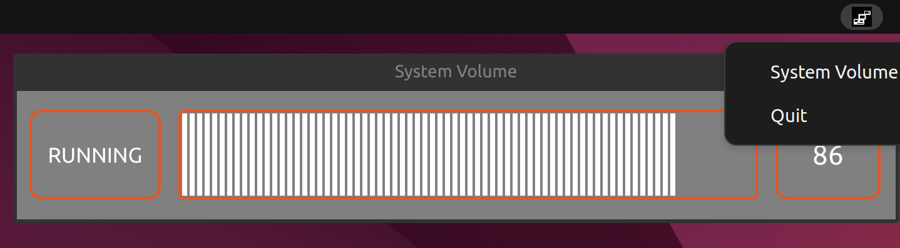

# Ubuntu Volume Controller

This app allow user to controll the default sink volume.<br>
When running the app a QSystemTray widget appear on the system tray and when clicking on it will open a action menu 
that allow to open a widget that control the default sink volume using keyboard or mouse wheel.



<b>Shortcuts</b>:
- Left Arrow/Wheel Down  - decrease volume 5/10
- Right Arrow/Wheel Up  - increase volume 5/10
- M - mute or unmute
- H - hide window
- Q - terminate app


<b>For this app to work you will need</b>:
- Python 3.10.6
- PySide6 version 6.4.2
- Ubuntu 22.04.1 LTS.
- pactl 15.99.1
 


<b>How to use:</b>
```bash
#clone repo
git clone https://github.com/ip-repo/vc.git

#venv
python3 -m venv vc_venv
source vc_venv/bin/activate
pip install PySide6==6.4.2

cd vc
python3 run.py
```


<b>Limitations:</b>
- Shortcuts will work only if System Volume widget is open.
- If default sink is not found then the app wont work correctlly.
